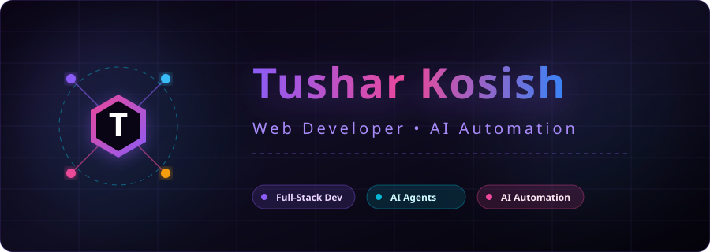

<!-- ANIMATED HERO -->
<div align="center">
  <picture>
    <source media="(prefers-color-scheme: dark)" srcset="./assets/hero-premium.svg">
    <source media="(prefers-color-scheme: light)" srcset="./assets/hero-premium.svg">
    
  </picture>
</div>

<!-- TYPING -->
<div align="center">

[](https://git.io/typing-svg)

</div>

<!-- BADGES -->
<div align="center">

<a href="https://github.com/Tushar-Kosish?tab=followers"></a>

<a href="mailto:tusharkaushish2007@gmail.com"></a>

</div>

<br/>

## 👤 About Me

```ts
const tushar = {
  pronouns:     "He/Him",
  focus:        "Full-stack web applications & autonomous AI agents",
  learning:     "Advanced AI engineering, system architecture, & cloud scale",
  collaborate:  "Innovative SaaS, AI automated tooling, & early-stage startup ideas",
  funFact:      "I love turning creative ideas into scalable digital products",
};
```

<br/>

## 💻 Tech Stack

<div align="center">
  
</div>

<br/>

## 📈 Activity

<div align="center">
  
</div>

<br/>

## 🐍 Contribution Snake

<div align="center">
  <picture>
    <source media="(prefers-color-scheme: dark)" srcset="https://raw.githubusercontent.com/Tushar-Kosish/Tushar-Kosish/output/github-contribution-grid-snake-dark.svg">
    <source media="(prefers-color-scheme: light)" srcset="https://raw.githubusercontent.com/Tushar-Kosish/Tushar-Kosish/output/github-contribution-grid-snake.svg">
    
  </picture>
</div>

<br/>

## 🏆 GitHub Trophies

<div align="center">
  
</div>

<br/>

## 📊 GitHub Analytics

<div align="center">
  <table>
    <tr>
      <td align="center"></td>
      <td align="center"></td>
    </tr>
    <tr>
      <td align="center" colspan="2"></td>
    </tr>
  </table>
</div>

<br/>

## 🌐 Connect With Me

<div align="center">

[](https://discord.gg/tushar_02389)
[](https://www.instagram.com/tusharsflex?igsh=YXlrazVrMnBoeXVy)
[](https://www.linkedin.com/in/tushar-kosish-6983883a6?utm_source=share&utm_campaign=share_via&utm_content=profile&utm_medium=android_app)
[](https://x.com/Tusharkosish)
[](mailto:tusharkaushish2007@gmail.com)

</div>

<br/>

<div align="center">

### ✍️ Random Dev Quote


</div> 
